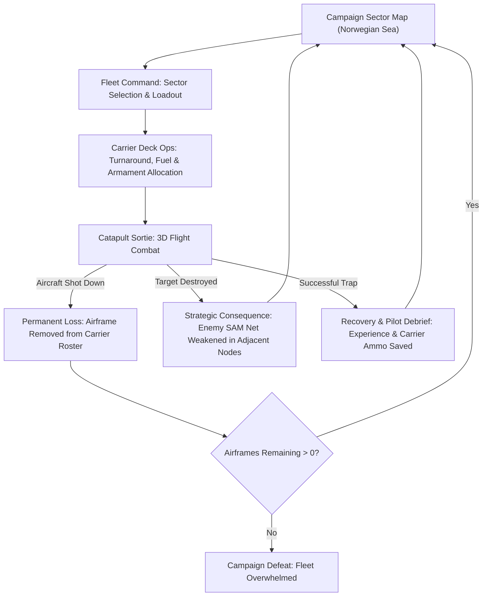

# Carrier Vector 1988: Gameplay Recommendations & Development Roadmap

This document outlines the concrete architectural and design recommendations for transforming *Carrier Vector: 1988* into an accessible, attractive, and deeply engaging game. Each recommendation includes its design rationale and player psychology impact.

---

## 1. How to Make the Game Easy to Understand and Play

### 1.1. Narrative-Driven, Isolated Onboarding (Fixing Known Issue #32)
* **The Problem:** New players are currently presented with a technical checklist while launching directly into an active SAM engagement corridor.
* **The Solution:** 
  1. Create a dedicated `TRAINING_SORTIE` scenario located in a safe, non-combat sector (e.g., North Sea staging grounds).
  2. Completely suppress hostile radar emitters and SAM batteries in this mission.
  3. Replace the text checklist with scripted **Radio Callouts** from a flight instructor or wingman ("Ghost-Lead"):
     * *"Good cat shot, 201. Pull back gently on the stick, level out at 2,500 feet."*
     * *"Engage autopilot by pressing [A]. Notice how she holds attitude? Now arm your Sidewinders with [W]."*
     * *"Target drone detected at bearing 020. Lock with [SPACE] and take the shot."*
* **Design Rationale:** Players learn mechanics exponentially faster through conversational, narrative prompts than through technical manuals. Learning must take place in an emotionally safe environment before testing skills under fire.

### 1.2. 3D Threat Dome & Radar Horizon HUD Symbology
* **The Problem:** Terrain masking is mathematically modeled in the engine, but invisible to the player. Players don't know *why* they were detected or *where* the radar beam is coming from until a missile is already in the air.
* **The Solution:** 
  * Add a subtle vector dome or radar cone overlay on the tactical MFD (Multi-Function Display).
  * When approaching a mountain ridge, render a visible "radar horizon line" on the HUD showing the altitude boundary where the aircraft becomes visible to enemy emitters.
* **Design Rationale:** Transparency builds mastery. When players clearly see the invisible boundary of enemy radar, hugging the canyon floor becomes an intentional, thrilling stealth maneuver rather than blind luck.

### 1.3. Arcade "Time-Rewind" (The "Oops" Mechanic)
* **The Problem:** In `ARCADE` mode, a single instant-death missile strike ruins a 10-minute sortie, causing rage-quitting.
* **The Solution:** 
  * Implement a cyclic state buffer storing the last 5 seconds of flight telemetry.
  * In `ARCADE` mode, pressing `[BACKSPACE]` or a dedicated rewind button steps the simulation backward 5 seconds, giving the player two chances per sortie to flare, chaff, or dive into a canyon.
* **Design Rationale:** Lowers the barrier to entry for casual players while preserving the hardcore unforgiving nature of `SIM` and `MANUAL` modes.

---

## 2. How to Make the Game Visually & Acoustically Attractive

### 2.1. Vector Fragmentation Explosion Physics ("Game Feel" / Juice)
* **The Problem:** Enemies currently vanish or collapse abruptly upon destruction, offering zero kinetic gratification.
* **The Solution:** 
  * In `src/renderer/VectorRenderer.ts`, upon target destruction, break the 3D wireframe line segments into 8–16 independent physical line debris objects.
  * Impart each fragment with the parent aircraft's velocity plus an outward explosive radial impulse and random 3D angular rotation.
  * Render decaying phosphor trails behind tumbling fragments as they arc toward the ocean surface.
* **Design Rationale:** In retro-vector games, the visual destruction of geometric lines is the primary visceral payoff (reminiscent of arcade classics like *Battlezone* and *Star Wars*).

### 2.2. Procedural Dynamic Synthwave Audio
* **The Problem:** The current audio engine produces an impressive low-frequency ambient threat drone, but lacks musical momentum or emotional escalation.
* **The Solution:** 
  * In `src/audio/WebAudioSystem.ts`, introduce an arpeggiated 1980s bassline synthesized via procedural FM/subtractive synthesis (zero WAV assets).
  * Bind bassline tempo and filter cutoff frequency to game state:
    * **Deck/Cruising:** Low-tempo, filtered, atmospheric drone (60 BPM).
    * **Radar Paint (`SPIKE`):** Urgent, rising arpeggiated sequence (110 BPM).
    * **Missile Inbound (`THREAT`):** Fast, aggressive driving synth bassline (135 BPM) with intense sidechain compression.
* **Design Rationale:** Music dictates physiological arousal. Dynamic music synchronizes the player's heart rate with the tactical danger on screen.

### 2.3. Cockpit Glass Distortions & Electronic Warfare Static
* **The Problem:** Being locked or jammed has minimal visual presence beyond text warnings.
* **The Solution:** 
  * Introduce procedural horizontal CRT scanline tearing and phosphor jitter when flying inside an enemy radar jamming cone or when taking nearby flak hits.
  * Add camera-shake impulses proportional to cannon recoil and missile motor ignition.
* **Design Rationale:** Physicalizing electronic warfare on the CRT display reinforces the gritty Cold War hardware aesthetic.

---

## 3. The Core Macro Pivot: The Rogue-lite Fleet Campaign

To permanently resolve the "shallow deck loop" and lack of stakes, the game should transition from isolated arcade missions into a **persistent Rogue-lite Campaign**:

### 3.1. Campaign Mechanics
1. **The Carrier as a Living Base:**
   * The carrier starts with a finite air wing: **24 F-14 Tomcat airframes** and **12 A-6 Intruder airframes**.
   * Ammo (AIM-9, AIM-7, GBU-12) and aviation fuel (JP-5) are finite campaign reserves.
   * If a plane crashes or is shot down, it is **permanently destroyed** and subtracted from the carrier's inventory.
2. **Node-Based Strategic Map:**
   * The player charts a course across a node graph of the Norwegian Sea.
   * Node types:
     * **Early Warning Radar Stations:** Destroying these blinds enemy air defenses in adjacent sectors.
     * **Airfields:** Neutralizing these stops enemy MiG-23 combat air patrols.
     * **Surface Action Groups:** High-threat warships protecting choke points.
     * **Underway Replenishment (UNREP):** Safe supply convoys to replenish fuel and airframes.
3. **Mid-Mission Dynamic Objectives:**
   * Evolve `src/core/Scenarios.ts` from static configs into a reactive event engine.
   * Example: During a canyon strike, an emergency radio call arrives: *"Mayday! Badger strike inbound on the carrier bearing 180, abort strike or break intercept!"* The player must choose between finishing their primary objective or turning back to defend the carrier.
