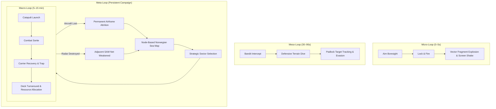

# Carrier Vector 1988: Recommendations & Architectural Roadmap

This document outlines the concrete architectural and gameplay blueprints for evolving *Carrier Vector: 1988* from an aerodynamic simulation into an engaging, high-retention indie game.

---

## 1. How to Make the Game Easy to Understand and Play

### 1.1. Narrative-Driven, Isolated Onboarding (Fixing Known Issue #32)
* **The Problem:** New players are presented with an engineering checklist while launching into an active SAM engagement corridor. At Second 12, climbing breaks terrain masking, causing an instant missile kill and tab closure.
* **The Solution:** 
  1. Create scenario `TRAINING_SORTIE` set in peaceful waters off Scotland.
  2. Suppress all hostile emitters, SAM sites, and enemy interceptors in this scenario.
  3. Replace the text checklist with scripted **Radio Callouts** from a wingman ("Ghost-Lead"):
     * *"Good launch, 201. Pull back gently to 2,500 ft."*
     * *"Engage Autopilot with [A]. Notice how she holds altitude? Now arm your Sidewinders with [W]."*
     * *"Target drone detected at bearing 020. Lock with [SPACE] and take the shot."*
* **Design Rationale:** Players absorb mechanics intuitively through conversational dialogue rather than technical manuals.

### 1.2. 3D Threat Dome & Radar Horizon HUD Symbology
* **The Problem:** Terrain masking is mathematically modeled, but invisible to the player until a missile is already in flight.
* **The Solution:** 
  * Add a subtle vector dome on the tactical MFD indicating enemy radar coverage.
  * Render a dynamic "radar horizon line" on the HUD pitch ladder showing the maximum safe altitude before radar line-of-sight is established.
* **Design Rationale:** Visualizing the invisible boundary of enemy radar makes terrain masking a deliberate, thrilling stealth maneuver.

### 1.3. Arcade "Time-Rewind" (The "Oops" Button)
* **The Problem:** In `ARCADE` mode, a single missile kill ruins a 10-minute sortie, causing rage-quitting.
* **The Solution:** 
  * Store a rolling 5-second circular buffer of aircraft telemetry and projectile positions.
  * In `ARCADE` mode, pressing `[BACKSPACE]` steps the simulation backward 5 seconds (up to 2 rewinds per sortie).
* **Design Rationale:** Reduces the harsh failure penalty for casual players while preserving hardcore challenge in `SIM` and `MANUAL` modes.

---

## 2. How to Make the Game Visually & Acoustically Attractive

### 2.1. Vector Fragmentation Explosion Physics ("Game Feel" / Juice)
* **The Problem:** Exploding targets abruptly vanish or display a minimal circle, offering zero kinetic satisfaction.
* **The Solution:** 
  * In `src/renderer/VectorRenderer.ts`, upon target destruction, break the 3D wireframe line segments into 10–16 independent physical line fragments.
  * Impart each fragment with parent aircraft momentum + outward radial explosion velocity (15–40 m/s) + random 3D angular tumble.
  * Apply gravity and air drag so fragments arc toward the ocean, rendering decaying phosphor trails.
  * In `src/renderer/Camera.ts`, trigger a 150ms screen-shake impulse proportional to distance.
* **Design Rationale:** In retro-vector games, the shattering of geometric lines is the primary visceral dopamine payoff.

### 2.2. Synthesized Cockpit Voice Warning System ("Bitchin' Betty")
* **The Problem:** The cockpit is completely mute, lacking the iconic audio alarms that define modern combat aviation.
* **The Solution:** 
  * In `src/audio/WebAudioSystem.ts` or via the zero-dependency native Web Speech API (`window.speechSynthesis`), synthesize robotic 1980s voice warnings:
    * *"PULL UP, PULL UP"* (Altitude < 200m and descent rate > 30 m/s).
    * *"WARNING: MISSILE LAUNCH"* (SAM guidance detected).
    * *"STALL, STALL"* (|α| > 18°).
    * *"BINGO FUEL"* (Fuel < 15%).
* **Design Rationale:** Voice warnings provide instantaneous, high-priority telemetry without forcing the pilot's eyes away from the boresight.

### 2.3. Padlock / Target-Tracking Camera Mode (`V` Key)
* **The Problem:** The 60° forward FOV blindfolds the player during dogfights when bandits circle outside the canopy.
* **The Solution:** 
  * Add a "Padlock" camera toggle (`V` key or mobile touch button).
  * While active, smoothly interpolate the camera's orientation to look directly at the designated target, allowing the player to track the bandit visually while maneuvering.
* **Design Rationale:** Eliminates the frustration of losing visual contact and brings the dogfighting experience in line with classic combat flight sims.

### 2.4. Procedural Dynamic Synthwave Audio
* **The Problem:** The current audio engine produces an impressive low-frequency ambient drone, but lacks musical adrenaline.
* **The Solution:** 
  * In `src/audio/WebAudioSystem.ts`, introduce an arpeggiated 1980s bassline synthesized via procedural FM/subtractive synthesis (zero audio files).
  * Bind tempo and filter cutoff frequency to tactical threat levels:
    * **Deck / Cruise:** Low-tempo, filtered, atmospheric drone (60 BPM).
    * **Radar Spike (`SPIKE`):** Urgent, rising arpeggiated sequence (110 BPM).
    * **Missile Threat (`THREAT`):** Fast, aggressive driving synth bassline (135 BPM).
* **Design Rationale:** Music synchronizes player heart rate with on-screen tactical danger.

---

## 3. The 4-Tier Game Loop Architecture & Rogue-lite Campaign

To solve the "passive deck loop" and lack of stakes, restructure the game into 4 distinct loop tiers:

### 3.1. Persistent Rogue-lite Fleet Campaign Blueprint
1. **The Carrier as a Living Base:**
   * Finite air wing: **24 F-14 Tomcat** and **12 A-6 Intruder** airframes.
   * Finite ordnance (AIM-9, AIM-7, GBU-12) and aviation fuel (JP-5).
   * Airframes lost during sorties are **permanently removed** from the carrier's roster.
2. **Node-Based Strategic Map:**
   * The player charts a course across 7 interconnected sectors of the Norwegian Sea.
   * **Cause & Effect:** Neutralizing an Early Warning Radar node reduces SAM detection range in adjacent sectors by 40%.
3. **Mid-Sortie Dynamic Objectives:**
   * Evolve `src/core/Scenarios.ts` from static configurations into a reactive event engine.
   * Example: *"Mayday! Badger strike inbound on the carrier bearing 180, abort strike or break intercept!"*
